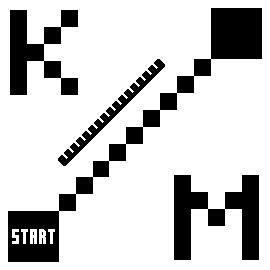

# KM to Start (GPS)

Kilometers to start from current position in straight line.

This DataField refreshes about every 10 seconds (counter `c` var) and only when is visible (auto call `onUpdate()` function), to reduce calculations.




## Usage

* Copy compiled `Start.prg` to the `APPS\` directory.
* Select: `Activity Settings` → `Data Screens` → `Screen #` → `Field #` → `Connect IQ` → `Start`.


## Compile
### Start.prg
```
monkeyc -y dev_key.der -f KMtoStartGPS\monkey.jungle -r -o Start.prg
```
### dev_key.der
```
openssl genrsa -out dev_key.pem 4096
openssl pkcs8 -topk8 -inform PEM -outform DER -in dev_key.pem -out dev_key.der -nocrypt
```


## Optimization
### Start_opt.mc

Size can be slightly reduced by hardcoding text color and x, y. Example: `dc.setColor(0x000000,0xFFFFFF);` `dc.drawText(107,27...);` or `(107,44...)`, depending on a field layout.